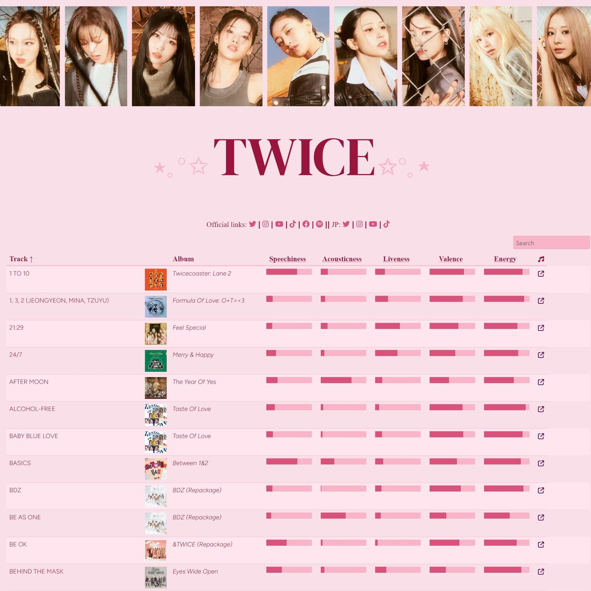

# Tabla interactiva
Tabla con las características musicales de las canciones del grupo de K-pop TWICE.

Permite ordenar de mayor a menor a partir de las *features* de las canciones, de acuerdo a los datos de Spotify.

# [LINK](https://vhgauto.github.io/TWICE_features/)

La tabla es interactiva usando el paquete [{reactable}](https://glin.github.io/reactable/index.html).
